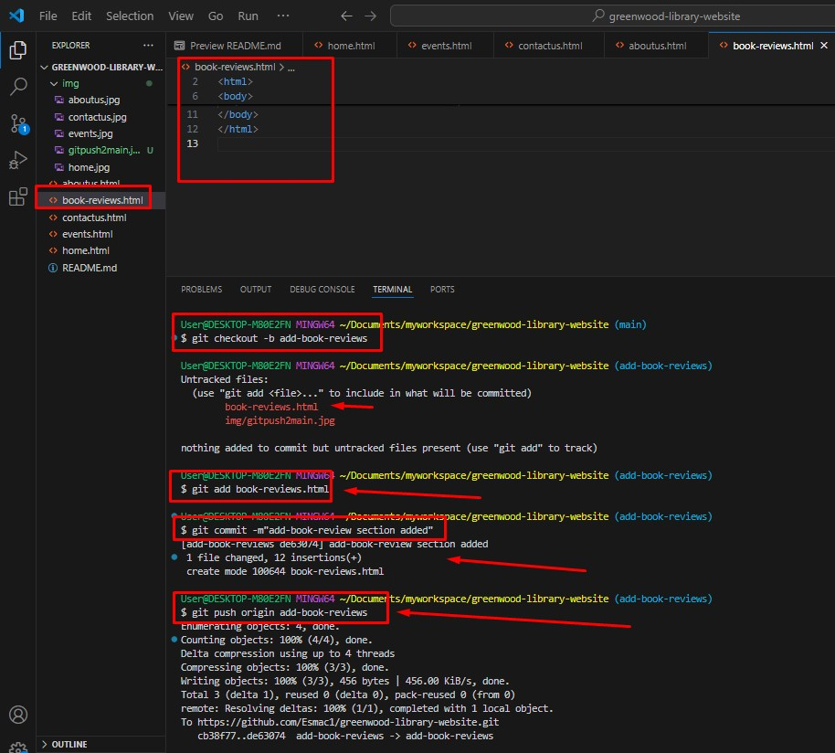
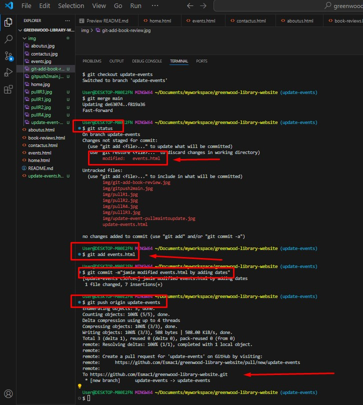
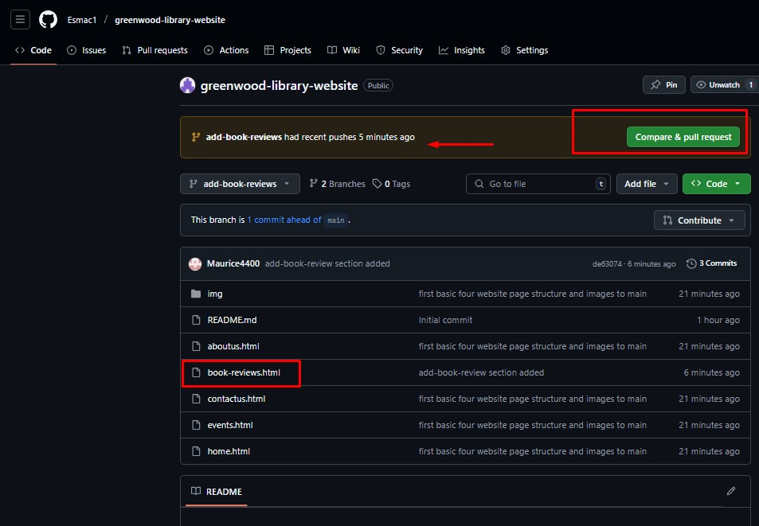
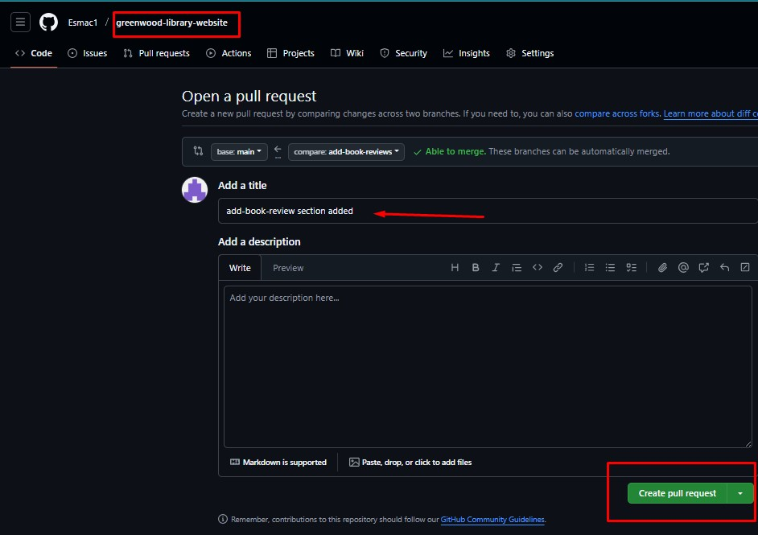
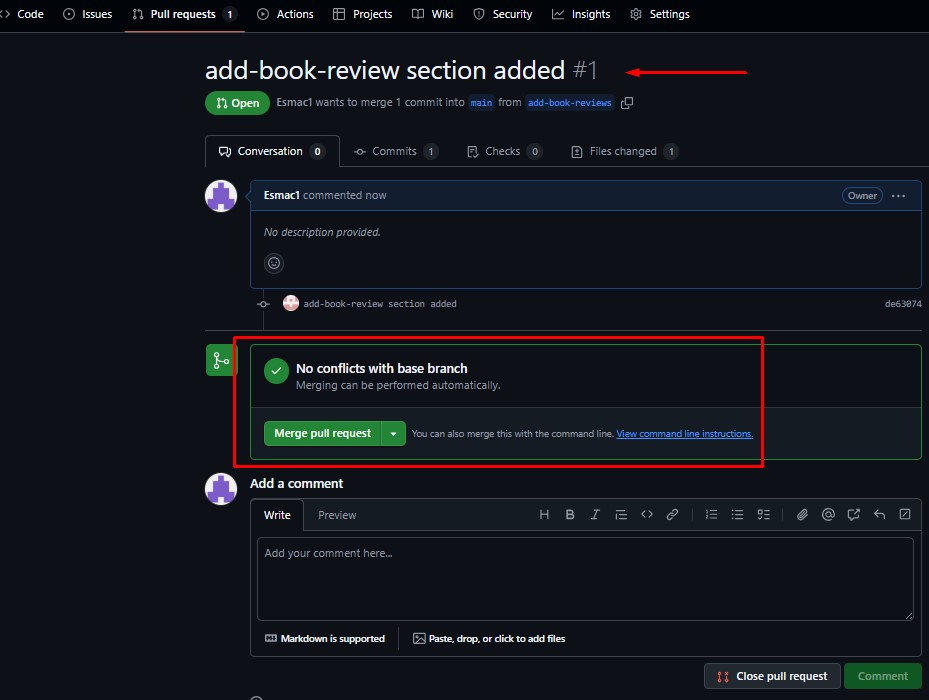
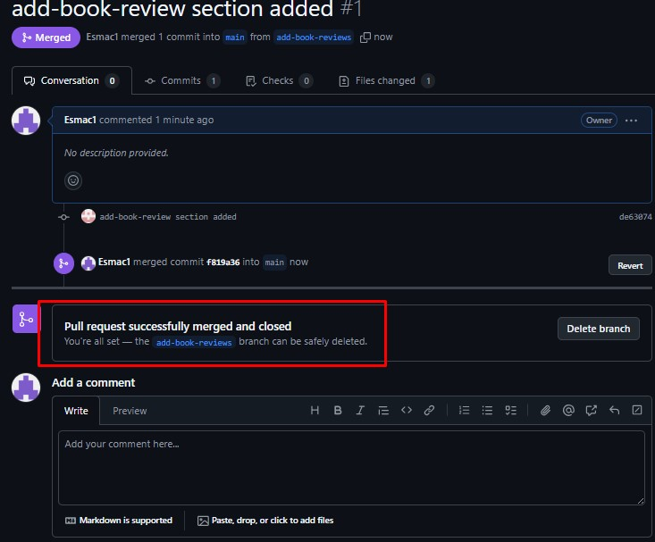
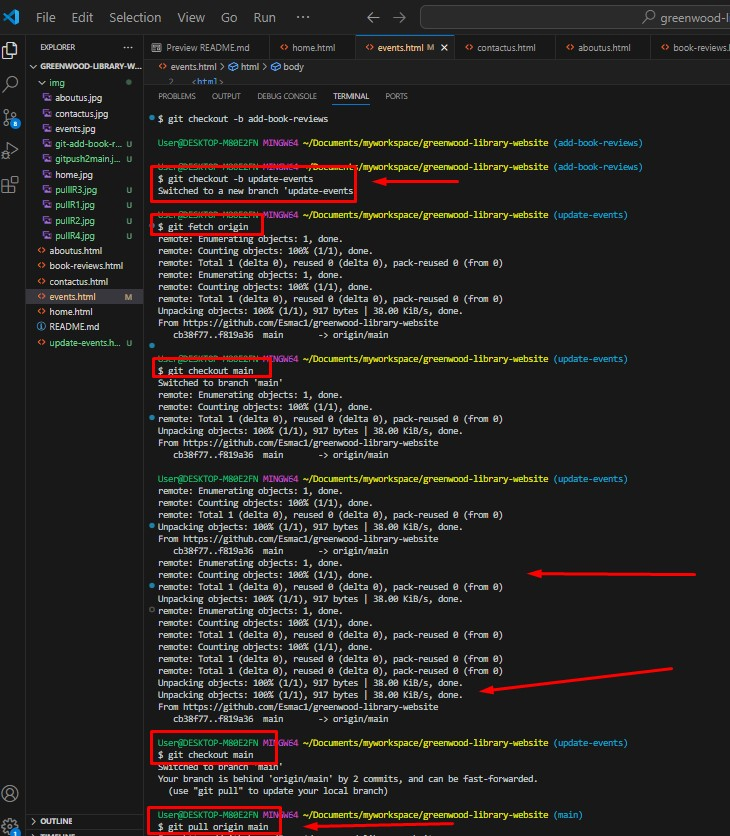
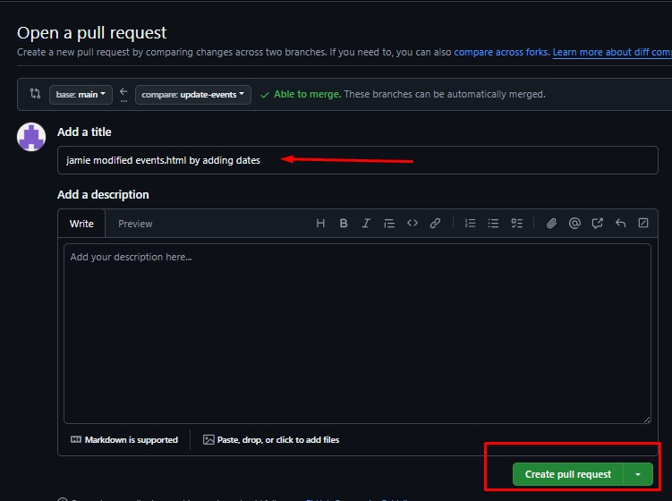
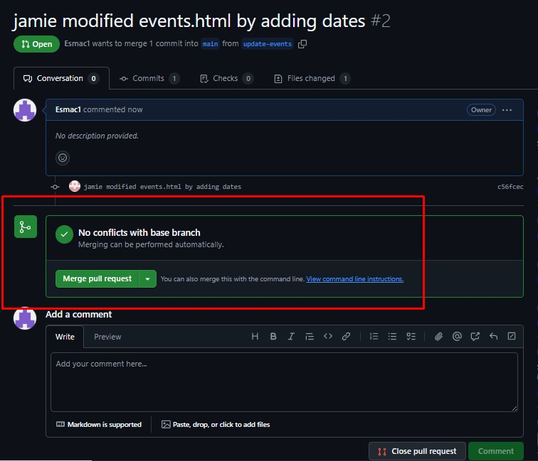
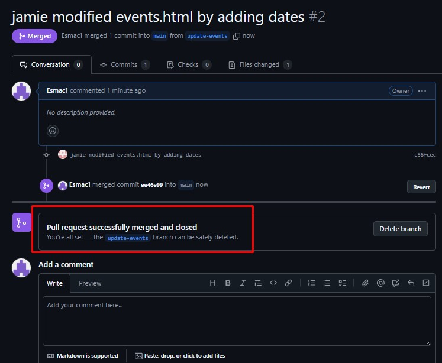

# Greenwood Community Library Website

This is a simple static website for the Greenwood Community Library. It includes information about the library, upcoming events, contact details, and book reviews.

## Pages

- `home.html` – Welcome page for the library.
- `aboutus.html` – Learn more about the library's mission and history.
- `events.html` – View upcoming library events and activities.
- `contactus.html` – Find contact details and get in touch.
- `book_reviews.html` – Read reviews of popular books (added by Morgan).

## Contributors

- **Morgan** – Added the `book_reviews.html` page.
- **Jamie** – Updated and enhanced the content in `events.html`.

## Branch Workflow

- `main` – The primary production branch.
- `add-book-reviews` – Feature branch by Morgan to add the book reviews page.
- `update-events` – Feature branch by Jamie to update the events page.

## How to Contribute

1. Clone the repository:
   ```bash
   git clone https://github.com/Esmac1/greenwood-library-website.git
   cd greenwood-library-website

## Create and switch to a new branch by Morgan
git checkout -b add-book-reviews

## Stage changes
git add book-reviews.html


## Commit changes
git commit -m "   "

## Push branch to GitHub
git push origin add-book-reviews


## create Pull Request








## Pull latest changes from main
git pull origin main

## checkout and switch to new branch by Jamie
- 'git checkout -b update-events'
- 'git fetch origin'
- 'git checkout main'
- 'git pull origin main'
### Switch back to update-events and merge. This ensures Jamie's branch has the latest content, including Morgan's merged book_reviews.html page.

### git checkout update-events


- 'git merge main'
- 'modify event.html by adding new line of code'
## Stage changes
git add event.html

## Commit changes
git commit -m "   "
## Push branch to GitHub
git push origin update-events
## create Pull Request







